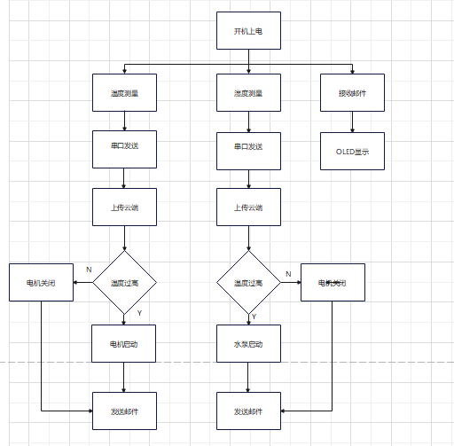
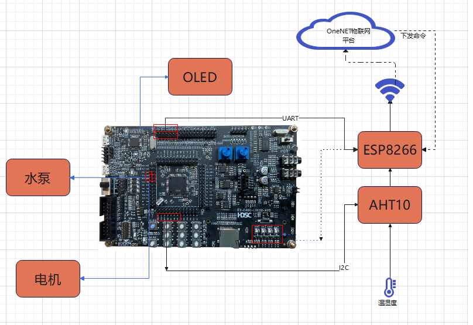
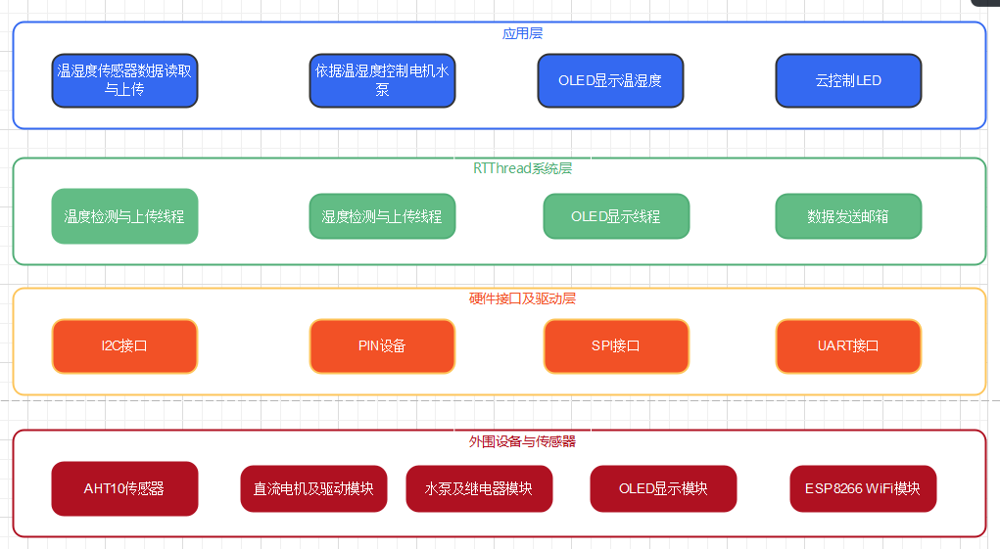
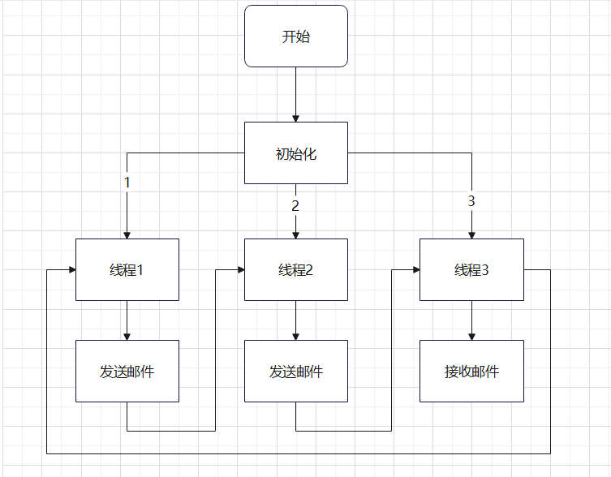

### 作品背景：

随着人们生活质量的提高，经常在家中工作和学习的环境中放置一些盆栽花卉，既可以通过光合作用吸收二氧化碳，净化室内空气，又可以陶冶情操，让生活，工作，学习更加愉悦。智能花盆是智能家居的一种备受喜爱的一种新型家居设备，随着科技的发展，智能家居的概念频频出现在各大媒体上，进入公众的视线。本作品基于智能花盆的思路，设计了一种智能花盆设备的模型。

### 实现功能：

通过温湿度传感器进行温湿度采集，将采集到的数据通过串口发送温湿度到上位机，并利用wifi模块将温湿度上传到云端，在手机端可以通过onenet云查看家中温湿度，利用OLED屏幕实时显示温湿度，便于在家中查看。如果温度过高电机（风扇）开启进行降温，湿度过低水泵开启为花卉浇水，云端控制4种颜色led灯的开关，实现光源供应。

### RT-Thread使用情况概述：

内核方面，使用了线程，邮箱实现任务调度。具体创建了三个线程分别进行温度的检测与上传，湿度的检测与上传和OLED显示数据。两个邮箱，一个在"温度检测与上传"线程中用来传递温度值给"OLED显示数据"的线程，另一个在"湿度检测与上传"线程中用来传递湿度值给"OLED显示数据"的线程。软件包方面，aht10传感器驱动库，u8g2不同种类单色屏驱动库,cJSON,OneNET连接中国移动 OneNet 云的软件包,AT DEVICE,WebClient(RT-Thread 官方开源的 http/https 协议客户端)。

### 整体系统框架：

### 硬件框架说明：

### 软件框架说明：

### 软件模块说明:

