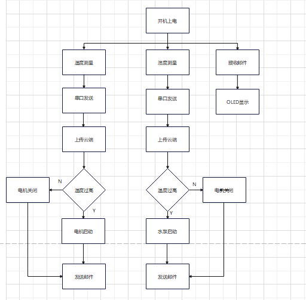
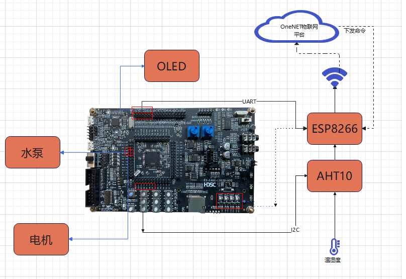
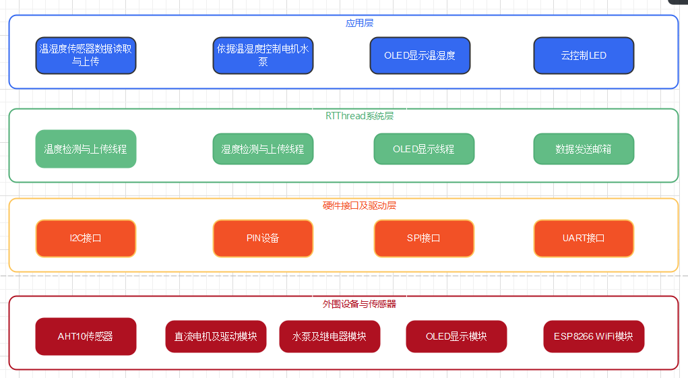
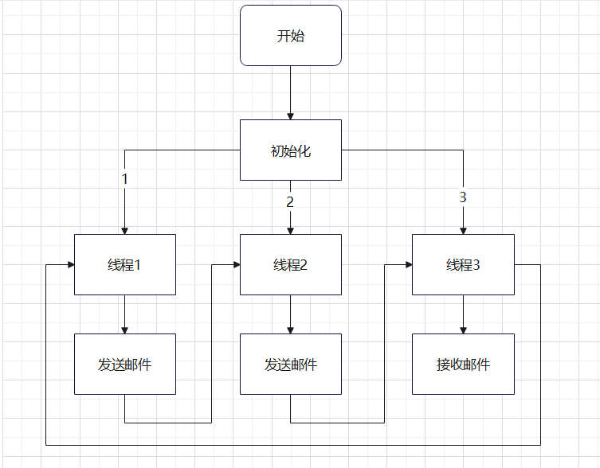

# 智能花盆模型
## 目录

+ 一、作品背景

+ 二、实现功能

+ 三、RT-Thread使用情况概述

+ 四、整体系统框架

+ 五、硬件框架说明

+ 六、软件框架说明

+ 七、软件模块说明

  

### 一、作品背景：

随着人们生活质量的提高，经常在家中工作和学习的环境中放置一些盆栽花卉，既可以通过光合作用吸收二氧化碳，净化室内空气，又可以陶冶情操，让生活，工作，学习更加愉悦。智能花盆是智能家居的一种备受喜爱的一种新型家居设备，随着科技的发展，智能家居的概念频频出现在各大媒体上，进入公众的视线。本作品基于智能花盆的思路，设计了一种智能花盆设备的模型。

### 二、实现功能：

- 通过温湿度传感器进行温湿度采集，将采集到的数据通过串口发送温湿度到上位机，并利用wifi模块将温湿度上传到云端，在手机端可以通过onenet云查看家中温湿度。

* 利用OLED屏幕实时显示温湿度，便于在家中查看。

* 如果温度过高，则电机（风扇）开启进行降温，湿度过低则，水泵开启为花卉浇水。

* 云端控制4种颜色led灯的开关，实现光源供应。

### 三、RT-Thread使用情况概述：

#### 3.1 内核方面

  - 使用了线程，邮箱实现任务调度。具体创建了三个线程分别进行温度的检测与上传，湿度的检测与上传和OLED显示数据。

  - 使用两个邮箱，一个在"温度检测与上传"线程中用来传递温度值给"OLED显示数据"的线程，另一个在"湿度检测与上传"线程中用来传递湿度值给"OLED显示数据"的线程。

#### 3.2 软件包方面

  - aht10传感器驱动库：实现AHT10驱动，在应用层调用测量温湿度。

  - u8g2不同种类单色屏驱动库：实现OLED驱动，在应用层调用显示温湿度。

  - cJSON: 超轻量级的 C 语言 json 解析库。

  - OneNET连接中国移动 OneNet 云的软件包：实现硬件连接云端，在应用层调用上传温湿度，以及下发命令控制硬件。

  - AT DEVICE：AT 组件在不同设备上的移植或示例。

  - WebClient(RT-Thread 官方开源的 http/https 协议客户端)。

#### 3.3 设备驱动框架使用情况

  - pin设备驱动框架，

  - IIC设备驱动框架

  - UART设备驱动框架,

  - SPI设备驱动框架,

### 四、整体系统框架：




### 五、硬件框架说明：

关于硬件的连接情况以及功能如下图所示：



### 六、软件框架说明：



#### 6.1 应用层
  - 要介绍该工程的具体功能
#### 6.2 RTThread系统层
  - 主要介绍了使用的RTThread内核以及工具
#### 6.3 硬件接口及驱动层
- 主要介绍了使用到的一些板载硬件资源
- 接口使用说明
  - I2C接口接AHT10
  - PIN接电机驱动模块，以及控制水泵的继电器模块
  - SPI接口接OLED显示屏
  - UART接口接ESP8266
#### 6.4 外围设备与传感器
- 主要介绍了使用到的一些硬件模块

### 七、软件模块说明:




#### 7.1 初始化过程，该过程主要在main函数中进行，代码如下：

```C
int main(void)
{
  //配置LED相应引脚输出模式
      rt_pin_mode(LED_RED_PIN, PIN_MODE_OUTPUT);
      rt_pin_mode(LED_GREEN_PIN, PIN_MODE_OUTPUT);
      rt_pin_mode(LED_ORANGE_PIN, PIN_MODE_OUTPUT);
      rt_pin_mode(LED_BLUE_PIN, PIN_MODE_OUTPUT);
      //配置电机相关引脚输出模式
      rt_pin_mode(ENA, PIN_MODE_OUTPUT);
      rt_pin_mode(IN1, PIN_MODE_OUTPUT);
      rt_pin_mode(IN2, PIN_MODE_OUTPUT);
      //配置电机相关引脚输出模式
      rt_pin_mode(WATER_PUMP, PIN_MODE_OUTPUT);
  
      //查找AHT10设备
      dev1 = rt_device_find(argv0[0]);
      dev2 = rt_device_find(argv0[1]);
      //onenet 初始化
      onenet_mqtt_init();
      rt_thread_mdelay(2000);
      //定义测温，测湿度设备
      sensor1 = (rt_sensor_t)dev1;
      sensor2 = (rt_sensor_t)dev2;
      //云命令回调
      onenet_set_cmd_rsp_cb(onenet_cmd_rsp_cb);
      //OLED相关初始化
      OLED_Init();
      UI_init();
      //启动线程
      program_sample();
  }
  
  ```

  

#### 7.2 软件共包含3个自行设计的线程

  * 线程1实现功能包括：

    （1）读取温湿度传感器测得的温度值，

    （2） 通过串口向上位机发送数据，

    （3）通过wifi模块向向云端发送数据，

    （4）通过邮箱发送包含温度信息的邮件,

    （5）判断温度值大小采取相应措施,

  + 线程2实现功能包括：

    （1）读取温湿度传感器测得的湿度值，

    （2） 通过串口向上位机发送数据，

    （3）通过wifi模块向向云端发送数据，

    （4）通过邮箱发送包含湿度信息的邮件,

    （5）判断湿度值大小采取相应措施,

  + 线程3实现功能包括：

    （1）接收邮件，

    （2） 将邮件中的信息显示在OLED，

  * 主要代码如下：

  ```c
  //线程句柄定义
  rt_thread_t tid1,tid2,tid3;
  //线程1入口函数
  void temp_check_entry(void* parameter)
  {
  
      double temp;
  
      while(1)
      {
          rt_device_open(dev1, RT_DEVICE_FLAG_RDWR);
          sensor1 = (rt_sensor_t)dev1;
          rt_device_read(dev1, 0, &data1, 1);
          sensor_show_data(0,sensor1,&data1);
  
          rt_mb_send(&mb,data1.data.temp);
  
          temp=(double)(data1.data.temp)/10;
          onenet_mqtt_upload_digit(argv2[0],temp);
          rt_thread_mdelay(1000);
  
          if(temp>33.5)
          {
              //���罵��
              rt_pin_write(ENA, PIN_HIGH);
              rt_pin_write(IN1, PIN_LOW);
              rt_pin_write(IN2, PIN_HIGH);
          }
          else
          {
              rt_pin_write(ENA, PIN_LOW);
          }
  
          rt_device_close(dev1);
  
          rt_thread_mdelay(1000);
      }
  }
  //线程2入口函数
  void humi_check_entry(void* parameter)
  {
  
      double humi=70;
  
      while(1)
      {
          rt_device_open(dev2, RT_DEVICE_FLAG_RDWR);
          sensor2 = (rt_sensor_t)dev2;
          rt_device_read(dev2, 0, &data2, 1);
          sensor_show_data(0,sensor2,&data2);
  
          rt_mb_send(&mb1,data2.data.humi);
  
  
          humi=(double)(data2.data.humi)/10;
          onenet_mqtt_upload_digit(argv2[1],humi);
          rt_thread_mdelay(1000);
          if(humi<75.0)
          {
              rt_pin_write(WATER_PUMP, PIN_LOW);
          }
          else
          {
              rt_pin_write(WATER_PUMP, PIN_HIGH);
          }
  
          rt_device_close(dev2);
  
          rt_thread_mdelay(1000);
      }
  }
  //线程3入口函数
  void OLED_entry(void* parameter)
  {
      rt_ubase_t temp,humi;
      while(1)
      {
          rt_mb_recv(&mb, &temp, RT_WAITING_FOREVER);
          rt_mb_recv(&mb1, &humi, RT_WAITING_FOREVER);
          OLED_SHOW_TEMP(temp,humi);
          //OLED_SHOW_HUMI(700);
          rt_thread_mdelay(200);
      }
  }
  //线程初始化
  int program_sample()
  {
  
     tid1 = rt_thread_create("temp_check",
              temp_check_entry,
              RT_NULL,
              STACT_SIZE,
              PRIORITY,
              TICK);
     if(tid1!=RT_NULL)
         rt_thread_startup(tid1);
  //   -------------------------------------
     tid2 = rt_thread_create("humi_check",
                 humi_check_entry,
                 RT_NULL,
                 STACT_SIZE,
                 PRIORITY,
                 TICK);
      if(tid2!=RT_NULL)
            rt_thread_startup(tid2);
  //   -------------------------------------
      tid3 = rt_thread_create("OLED",
              OLED_entry,
                  RT_NULL,
                  STACT_SIZE,
                  PRIORITY,
                  TICK);
         if(tid3!=RT_NULL)
             rt_thread_startup(tid3);
  
  
         rt_err_t result;
  
            /* 初始化一个 mailbox */
            result = rt_mb_init(&mb,
                                "mbt",                      /* 名称是 mbt */
                                &mb_pool[0],                /* 邮箱用到的内存池是 mb_pool */
                                sizeof(mb_pool) / 4,        /* 邮箱中的邮件数目，因为一封邮件占 4 字节 */
                                RT_IPC_FLAG_FIFO);          /* 采用 FIFO 方式进行线程等待 */
            if (result != RT_EOK)
            {
                rt_kprintf("init mailbox failed.\n");
                return -1;
            }
  
        rt_err_t result1;
  
         /* 初始化一个 mailbox */
         result1 = rt_mb_init(&mb1,
                             "mbt1",                      /* 名称是 mbt */
                             &mb1_pool[0],                /* 邮箱用到的内存池是 mb_pool */
                             sizeof(mb1_pool) / 4,        /* 邮箱中的邮件数目，因为一封邮件占 4 字节 */
                             RT_IPC_FLAG_FIFO);          /* 采用 FIFO 方式进行线程等待 */
         if (result1 != RT_EOK)
         {
             rt_kprintf("init mailbox failed.\n");
             return -1;
         }
  }

